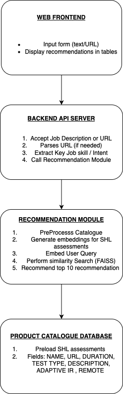

# Time2Qualify  
## _AI-Powered Assessment Recommendation Engine_

**Time2Qualify** is an intelligent assessment recommendation system that matches job descriptions to relevant SHL tests using semantic understanding. Built with Node.js,React.js, Express, Hugging Face, and Pinecone, it simplifies and automates the process of selecting the right assessments for any role.

---

## 🔍 Purpose

Hiring managers often struggle to choose the right assessments from large catalogs. Time2Qualify solves this by analyzing job descriptions (text or URL) and suggesting the most relevant SHL assessments — saving time and improving accuracy.

---

## 🚀 Features

- 🧠 Uses Hugging Face models to generate semantic embeddings of job descriptions and assessments  
- 📚 Stores and searches SHL assessments in a Pinecone vector database  
- 🔗 Accepts natural language job descriptions or URLs  
- 📊 Returns top 1–10 recommended assessments with:
  - Assessment name (linked to SHL site)
  - Remote testing & adaptive support (Yes/No)
  - Duration and test type

---

## 🏗️ Architecture

The system is composed of:

- **Frontend (React)**: Job description input, results display  
- **Backend (Node.js + Express)**: Handles job description input, embedding, Pinecone search  
- **Hugging Face**: Generates semantic embeddings  
- **Pinecone**: Vector database for efficient semantic similarity search  
- **Manual SHL data ingestion**: Assessments initially stored in JSON with Hugging Face embeddings

## System Design


---


## 🧪 Sample Output (Tabular Recommendation)

| Assessment Name | Remote | Adaptive | Duration | Type |
|-----------------|--------|----------|----------|------|
| [Verbal Reasoning Test](https://www.shl.com/...) | Yes | Yes | 20 min | Cognitive |
| [Situational Judgement Test](https://www.shl.com/...) | Yes | No | 25 min | Behavioral |

---

## 🧠 Tech Stack

- [Node.js](https://nodejs.org/) – Backend runtime  
- [Express](https://expressjs.com/) – Web framework  
- [React](https://reactjs.org/) – Frontend framework  
- [Hugging Face](https://huggingface.co/) – Embedding generation (e.g., `all-MiniLM-L6-v2`)  
- [Pinecone](https://www.pinecone.io/) – Vector database for semantic similarity search  
- [dotenv](https://www.npmjs.com/package/dotenv) – Environment config

---

## 📁 Folder Structure


---

## ⚙️ Installation

```bash
# Clone the repository
https://github.com/ImKartikey27/Time2Qualify.git
cd time2Qualify

# Backend Setup
cd backend
npm install
cp .env.example .env

# Frontend Setup
cd ../frontend
npm install
```

## Development

Want to contribute? Awesome!

Time2Qualify is built with a modular, service-based architecture using modern JavaScript tooling. You can contribute to either the backend (Express API) or frontend (React app).

Follow these steps to get started:

### 🧩 Backend

Open a terminal and run:

```sh
cd backend
npm run dev
```

## Contributing

1. Fork the repository
2. Create your feature branch (`git checkout -b feature/amazing-feature`)
3. Commit your changes (`git commit -m 'Add some amazing feature'`)
4. Push to the branch (`git push origin feature/amazing-feature`)
5. Open a Pull Request

## 🧪 API Testing with Postman

- **Postman Collection**: [Download here](./public/Time2Hire.postman_collection.json)
- Import this collection into Postman to test all available API endpoints.
- Features included:
  - Pre-request scripts for automatic token generation
  - Automated tests for response status codes and data validation

### 🔧 How to Use
1. Open **Postman**
2. Click on **Import** and upload `Time2Qualify.postman_collection.json`
3. Run individual endpoints or use the **Collection Runner** to test them all at once
4. Check the **Tests tab** to view validation results

**Free Software, Hell Yeah!**

[//]: # (These are reference links used in the body of this note and get stripped out when the markdown processor does its job. There is no need to format nicely because it shouldn't be seen. Thanks SO - http://stackoverflow.com/questions/4823468/store-comments-in-markdown-syntax)

   [dill]: <https://github.com/joemccann/dillinger>
   [git-repo-url]: <https://github.com/joemccann/dillinger.git>
   [john gruber]: <http://daringfireball.net>
   [df1]: <http://daringfireball.net/projects/markdown/>
   [markdown-it]: <https://github.com/markdown-it/markdown-it>
   [Ace Editor]: <http://ace.ajax.org>
   [node.js]: <http://nodejs.org>
   [Twitter Bootstrap]: <http://twitter.github.com/bootstrap/>
   [jQuery]: <http://jquery.com>
   [@tjholowaychuk]: <http://twitter.com/tjholowaychuk>
   [express]: <http://expressjs.com>
   [AngularJS]: <http://angularjs.org>
   [Gulp]: <http://gulpjs.com>

   [PlDb]: <https://github.com/joemccann/dillinger/tree/master/plugins/dropbox/README.md>
   [PlGh]: <https://github.com/joemccann/dillinger/tree/master/plugins/github/README.md>
   [PlGd]: <https://github.com/joemccann/dillinger/tree/master/plugins/googledrive/README.md>
   [PlOd]: <https://github.com/joemccann/dillinger/tree/master/plugins/onedrive/README.md>
   [PlMe]: <https://github.com/joemccann/dillinger/tree/master/plugins/medium/README.md>
   [PlGa]: <https://github.com/RahulHP/dillinger/blob/master/plugins/googleanalytics/README.md>


